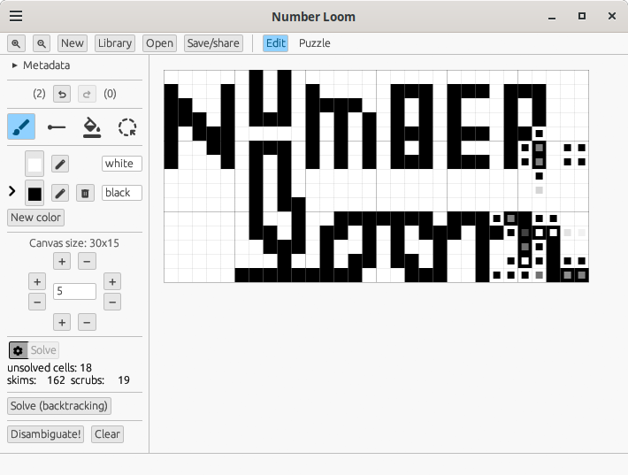
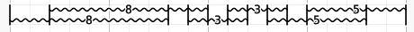

# `number-loom`

`number-loom` is a powerful tool for constructing the puzzles variously known as "Nonograms", "Paint By Numbers", "Griddlers", "Picross" (and **many** other names), plus a couple of variants.

You can also use it to test-solve your puzzles... or to solve puzzles for fun, if you like!

*Spot a change that makes the puzzle totally solvable and still look good!*

Number Loom helps you explore how edits affect solvability. Not only can it automatically solve your puzzle after each edit, it can suggest edits for how to make an unsolvable puzzle solvable! You can use it [in your browser](https://paul-stansifer.itch.io/number-loom), or install it on your own machine (see below).

## Features

* Supports the following file formats:
  * `webpbn`'s XML-based format (extension: `.xml` or `.pbn`)
  * The format used by the Olšák solver (extension: `.g`)
  * Images (typically `.png`, but many formats are supported.)
  * `char-grid`, a plaintext grid of characters, which it attempts to infer a reasonable character-to-color mapping (extension: `.txt`)
  * `.woven`, a format designed for Number Loom, mostly to facilitate transmitting puzzles as short(ish) text strings.
  * HTML, an export-only noninteractive view of the puzzle
* The following puzzles in the nonogram family are supported:
  * Regular nonograms
  * Trianograms, in which triangles may appear as "caps" for clues: black-and-white only.
  * Triddlers, in which cells are triangles on a hex grid, and clues appear on three axes
* An exhaustive line-logic solver that provides some difficulty information.
* "Disambiguator": a tool that searches for one-cell edits that make puzzles closer to solvable.
* A mode for test-solving, with a variety of toggleable assistance features:
  * Immediate error reporting
  * Limited background square inference
  * Indicators on lines for whether clues can make progress

## Installation and usage

`number-loom` can run in your browser! I've published it at https://paul-stansifer.itch.io/number-loom.

You can also install it to your machine if you're comfortable with the command line. The first step is to [install `cargo` through `rustup`](https://doc.rust-lang.org/cargo/getting-started/installation.html) if you haven't already.

Then run `cargo install number-loom`.

To open the gui: `number-loom` or `number-loom examples/png/keys.png --gui`.

To have `number-loom` solve a puzzle from the command line, do `number-loom examples/png/hair_dryer.png`.  Adding `--disambiguate` will attempt to find disambiguations if it can't solve it.

To convert a puzzle from the command line, do `number-loom examples/png/hair_dryer.png /tmp/hair_dryer.xml`.  Use `--input-format` or `--output-format` if you want to explicitly select a format: `webpbn`, `olsak`, `image`, `char-grid`, `woven`, or `html`. (The image format is still inferred from the filename.)

## Solver

In addition to requiring more steps or more attention, some nonograms require more advanced reasoning than others to solve. This sort of difficulty is tricky to usefully quantify, but there's one important distinction: "line logic" puzzles 

### Line logic

Line logic examines each line in isolation: if it can prove that a particular cell is or isn't a particular color, it "writes that down" and gets to use that fact in the future. This proceeds until it solves the puzzle or no more isolated line deductions can be made.

The "solve" (and auto-solve mode), as well as the disambiguator operate using line logic only: line logic is inherently pretty fast.

Internally, Number Loom's line logic solver has two modes:
  * "skim", which shoves all clues in a line as far as possible to one side and then the other, and checks to see if any of the clues (or gaps) overlap themselves between the two positions.
  * "scrub", which determines all possible locations of each clue, and then observes what cells are fixed. This gets all information it is possible to get from a particular line; it's more powerful, but slower than "skim".

In color nonograms "this cell is **not** green" is a valid thing to write down. Even though a human solver typically only writes down all-the-way-known cells, in my experience this corresponds pretty well to the sort of ad-hoc logic that human solvers perform on color nonograms when they glance at the both lines that contain a cell.

Looking at the number of scrubs and skims can tell you something about the difficulty of a puzzle. Unless you're aiming for an easy puzzle, the solver should have to do some scrubs. If the number of scrubs is higher than the width plus the length, or the number of skims is more than five times that, it's probably tedious relative to the size of the puzzle. This is a *very* rough guide: you should test-solve your puzzle to get an accurate view of the experience (click the "Puzzle" button!).

### Backtracking 

Adding the `--backtracking` argument in the CLI or pressing the "Solve (backtracking)" button in the GUI attempts to solve a puzzle that cannot be solved by line logic alone. The most common solving technique that people use that's outside the bounds of line logic is known as "edge logic".

Nonogram solving is [NP-complete](https://en.wikipedia.org/wiki/NP-completeness): this means that it is possible to create not-too-huge puzzles that are nonetheless impractical to solve. Such puzzles are pretty rare, but be prepared to click "Stop" rather than waiting forever.

Internally, Number Loom's backtracking solver works by alternatively making guesses and running the line-logic solver, keeping track of what guesses had what resulting grids; a guess that makes the puzzle impossible is a proof that the cell must be something else.

## GUI

### Edit mode

When editing a nonogram, you can:

* Paint by dragging / draw orthographic lines / flood fill
* Lasso-select and move a part of the image around
* Adjust the size of the canvas from any side
* Undo or redo with buttons or the "Z" and "Y" keys
* Add, remove, or recolor palette entries
* Solve the puzzle (it paints gray dots over unsolved cells), optionally automatically after each edit
* Disambiguate
* Switch to "Puzzle" mode to test-solve
* Edit metadata: title, description, author and license. The "title" is intended to be displayed before the puzzle is solved (typically, a vague hint), and the "description" is intended for display afterward (typically, a straightforward description of the puzzle).

#### Disambiguation

This may take a little bit of time, but it's typically reasonably fast for puzzles under 50x50. Cells will get a small square with an alternate color, with an opacity proportional to the number of unsolved cells that are resolved if that single cell is changed to that color. (It only ever displays one color, but there might be others that work just as well! Also, please remember that "solvable" is defined using line logic only here.)

It works by simply re-solving the puzzle with every possible one-square change, caching line configurations between solves. Typically, the more ambiguous the puzzle, the faster it is, so doing a guess-and-check with "auto-solve" turned on is sometimes a better way to hammer out small remaining ambiguities.

### Puzzle mode

In puzzle mode, left-click paints the currently-selected color, right-click paints blank squares, and middle-click paints "unsolved" (undo/redo also work). Mouse wheel cycles through the palette.

Shift-drag draws an "annotation" on the puzzle, which measures the distance that you drag it. Annotations always appear on the right side of the cells you dragged them in, so overlapping drags in opposite directions should be readable:

Shift-click to delete annotations, or add a single-cell annotation.

There's also count of the current contiguous line (in each direction) in the "clue gutter", and a widget (a "rosette") that breaks it down by direction from the cursor. There are also some toggleable assistance features (which can either be invoked immediately or automatically after each change):

* Detection of errors
* Inference of "obvious" background squares
* Indicators on the clue gutter of lines that can be progressed (circle for "skim", diamond for "scrub")
* Inference of which clues have been "finished"

Note: indicators only appear if some cell can be shown to have a particular color (including the background color) with line logic. However, the automatic solver can "partially solve" cells by ruling out some colors, and that partial information can be used by other lines. Therefore, on multicolor puzzles, it's possible for a solvable puzzle to at some point have no line-progress indicators!

## Variants
### Trianograms

Trianograms are a rare variant. "Mindful Puzzle Books" publishes a book by that name. The Olšák solver also supports this variant, crediting the concept to "the journal Maľované krížovky, Silentium s.r.o, Bratislava", but I haven't been able to find out more. There are square-grid puzzles with triangles at [griddlers.net](http://griddlers.net/), but I think they are merely traditional nonograms with triangular colors.

A trianogram has black, white, and four additional "colors": triangles that divide the cell into half-black and half-white. The triangles always serve as "caps" to a clue; for example "◢2◤" denotes that the four cells "◢■■◤" will appear. They will be consecutive, despite the fact that the caps are different "colors". Two consecutive clues will only be guaranteed to be separated by a space if neither of them is capped on the facing sides (if there are multiple identical consecutive triangles, they will each get their own clue).

The Olšák solver, I believe, supports multi-color trianograms, but `number-loom` does not yet.

Only the `olsak`, `woven` and `char-grid` formats can store trianograms (and `.html` can export them)

The "webpbn" format supports "triangular colors", but it does not support "clue cap" notion from trianograms; it's a purely cosmetic variation that `number-loom` doesn't support.

### Triddlers

Triddlers (named by analogy with "Griddler", one of the many names for this kind of puzzle) are another variant in which the cells are equilateral triangles, arranged on a hexagonal grid, and there are *three* different axes of clues, rather than *two*.

## Development

`number-loom` originated as a tool called `convert-nonogram`, which could convert images into the WebPBN and Olšák formats. I would create a puzzle in an bitmap image editor and use it to quickly test for solvability and difficulty with `pbnsolve`. Then I got interested in trianograms, which can't be constructed in an image editor at all, so I threw together a GUI editor and changed the name. Auto-solve and the disambiguator were the first big features, to justify the existence of a dedicated GUI tool.

After that, I've started using LLMs to make it possible to work faster. (I leaned on them heavily for triddler support, which would otherwise require a lot of tedious geometry, and for GUI improvements.) I try to keep the solver code mostly human-written (perhaps out of a misplaced sense of pride, but also because I think humans can write clearer code for that sort of stuff), along with the high-level data structures. I also don't like LLMs for prose, so UI text and the README and CHANGELOG are all human-written.